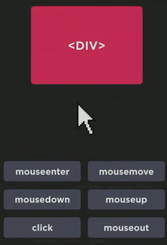

# EVENTOS QUE PODEM ACONTECER COM UMA DIV  
  
**mouseenter** - Quando movemos o mouse e chegamos dentro da div, disparamos o evento mouseenter, ou seja, o mouse entrou na div.

**mousemove** - Quando movemos o mouse dentro da div, vai ser disparado várias vezes o evento mousemove, ou seja, enquanto estiver movendo o mouse dentro da div, o evento mousemove será disparado várias vezes.

**mousedown** - Quando clicamos e pressionamos o mouse dentro da div, será disparado o evento mousedown, ou seja, clique e pressionamento do mouse dentro da div.

**mouseup** - Quando clicamos e soltamos o mouse, o evento mouseup será disparado, ou seja, depois do clique você soltar o botão do mouse.

**click** - Quando clicamos com o botão do mouse, o evento click será disparado, ou seja, apertar e soltar o botão do mouse.

**mouseout** - Do mesmo modo que o mouseenter, quando movemos o mouse para fora da div, será disparado o mouseout, ou seja, mover o mouse para fora da div.

Existem vários outros eventos, a lista é gigante de eventos.  

# FUNÇÕES EM JAVASCRIPT  

 
# ERROS NO JAVASCRIPT
Uma desvantagem no JavaScript é que ele não te dá o erro. O VSCODE mostra o erro. 
Para saber onde está o erro, basta ir no inspecionar, que é DevTools no navegador, que ele mostra tudo o que está acontecendo.